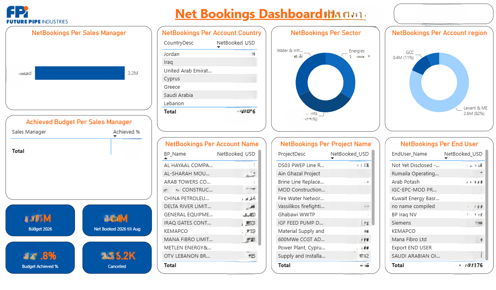
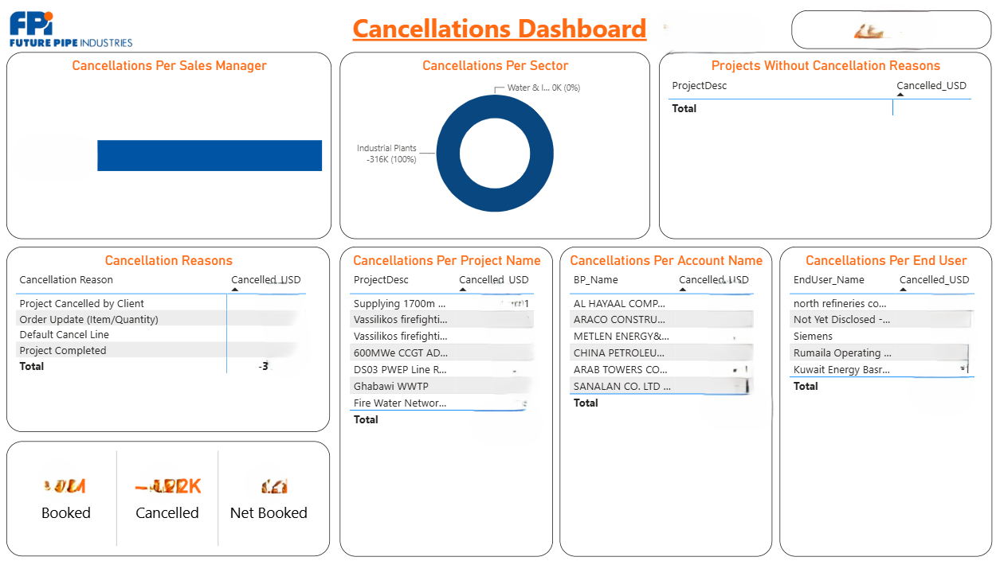

# Sales & CRM Analytics - Power BI

## Project Overview

This project presents a collection of Power BI dashboards developed to monitor sales performance, CRM activity, bookings, cancellations, forecasting, opportunity data quality, and registration progress.

I developed these dashboards to turn commercial and CRM data into clear and practical insights, making it easier to monitor performance, identify data quality issues, track progress, and support business decision-making.

> **Note:** The screenshots included in this repository have been anonymized to protect confidential business information. The original Power BI files and underlying datasets are not publicly shared.

---

## Dashboards

### 1. CRM Progress Dashboard

The CRM Progress Dashboard provides an overall view of CRM activity and sales pipeline progress.

The dashboard includes:

- Open quotations
- Open opportunities
- Quoted accounts
- Opportunity pool
- Forecast pool
- End-user project status
- Inquiry status
- Quotes created during the month
- Closed-won quotations
- Closed-lost quotations
- CRM utilization indicators
- Activity by division and country

This dashboard helps monitor CRM activity, pipeline status, and overall system utilization.

---

### 2. Net Bookings Dashboard

The Net Bookings Dashboard provides a detailed view of sales booking performance and budget achievement.

The dashboard includes:

- Annual budget
- Net booked value
- Budget achievement %
- Cancellation value
- Net bookings by sales manager
- Net bookings by country
- Net bookings by sector
- Net bookings by region
- Net bookings by account
- Net bookings by project
- Net bookings by end user

This dashboard helps compare actual booking performance against budget and identify the main contributors to sales performance.

---

### 3. Cancellations Dashboard

The Cancellations Dashboard focuses on analyzing cancelled sales and identifying the main sources and reasons for cancellations.

The dashboard includes:

- Total booked value
- Cancelled value
- Net booked value
- Cancellations by sales manager
- Cancellations by sector
- Cancellation reasons
- Cancellations by project
- Cancellations by account
- Cancellations by end user
- Projects without recorded cancellation reasons

This dashboard helps identify cancellation patterns, understand the main reasons behind cancellations, and highlight records that require further review.

---

### 4. Forecast Health Check

The Forecast Health Check dashboard provides a forward-looking view of sales performance against budget.

The dashboard includes:

- Annual budget
- Net booked value
- Budget achievement %
- Remaining forecast
- Projected budget achievement
- Sales booking forecast timeline
- Forecasted opportunities
- Forecasted inquiry status
- Remaining opportunities

The dashboard combines actual bookings with forecasted opportunities to provide visibility into expected performance and the remaining pipeline required to achieve the annual budget.

---

### 5. Opportunity Validation Dashboard

The Opportunity Validation Dashboard was developed to monitor opportunity records and support CRM data quality and validation.

The dashboard includes:

- Total opportunities
- Unique records
- Duplicate records
- Updated records
- Records under review
- Records pending validation
- Monthly record update status
- Opportunities by division
- Opportunity creation trends
- Team contribution
- Project and revenue analysis

Interactive filters allow users to analyze opportunities by status, validation status, team, region, and sales specialist.

This dashboard helps identify duplicate records, monitor data-cleaning progress, and improve the overall quality of opportunity data in CRM.

---

### 6. Registrations Analysis

The Registrations Analysis dashboard provides an overview of registration activities and their progress across different years and business units.

The dashboard includes:

- Total registrations
- Current-year registrations
- Completed registrations
- In-progress registrations
- Registration trends by year
- Monthly registration activity
- Registrations by business unit
- Registrations by sales manager
- Account-level registration details

Interactive filters allow users to analyze registration activities by:

- Requested year
- Business unit
- Sales manager
- Account

This dashboard helps monitor registration workload, historical trends, completion progress, and outstanding registration activities.

---

## Key Business Questions

These dashboards were developed to help answer business questions such as:

- How is current sales performance tracking against budget?
- What is the expected performance based on the current forecast?
- Which regions, sectors, accounts, and projects are contributing to bookings?
- What are the main reasons for sales cancellations?
- Which opportunities are contributing to the sales pipeline?
- How complete and reliable is the CRM opportunity data?
- Where are duplicate or unvalidated CRM records?
- How is CRM activity progressing over time?
- How actively is the CRM system being utilized?
- How are registration activities progressing?
- Which registrations are completed and which are still in progress?

---

## Tools & Skills

This project demonstrates practical experience in:

- Power BI
- Power Query
- DAX
- Data Cleaning
- Data Transformation
- Data Modeling
- Data Validation
- KPI Development
- CRM Analytics
- Sales Analytics
- Forecast Analysis
- Budget vs. Actual Analysis
- Trend Analysis
- Data Visualization
- Dashboard Design
- Business Intelligence
- Commercial Performance Analysis

---

## What I Worked On

My work across these dashboards included:

- Preparing and transforming commercial and CRM data
- Building data models and relationships
- Creating DAX measures and business KPIs
- Developing budget, actual, and forecast comparisons
- Monitoring CRM data quality and validation
- Identifying duplicate and incomplete opportunity records
- Analyzing sales bookings and cancellations
- Tracking forecast performance
- Monitoring registration activities
- Building interactive filters and slicers
- Designing dashboards for both high-level and detailed analysis

The main focus was to make the dashboards useful for regular business monitoring while keeping the information easy to navigate and understand.

---

## Data Privacy

The dashboards shown in this repository are portfolio versions of business dashboards.

Sensitive information has been hidden or anonymized where appropriate. The underlying datasets and original Power BI files are not publicly shared.

The screenshots are included to demonstrate my experience in Power BI development, commercial analytics, CRM analytics, dashboard design, and business reporting.

---

## Repository Contents

This repository contains screenshots of the following dashboards:

1. CRM Progress Dashboard
2. Net Bookings Dashboard
3. Cancellations Dashboard
4. Forecast Health Check
5. Opportunity Validation Dashboard
6. Registrations Analysis

---

## About This Project

This project demonstrates the practical use of Power BI across different areas of sales and commercial analytics.

It covers CRM monitoring, sales bookings, cancellations, forecasting, opportunity data quality, and registration tracking.

The dashboards were built not only for reporting, but also to support data validation, performance monitoring, forecasting, and day-to-day business analysis.
